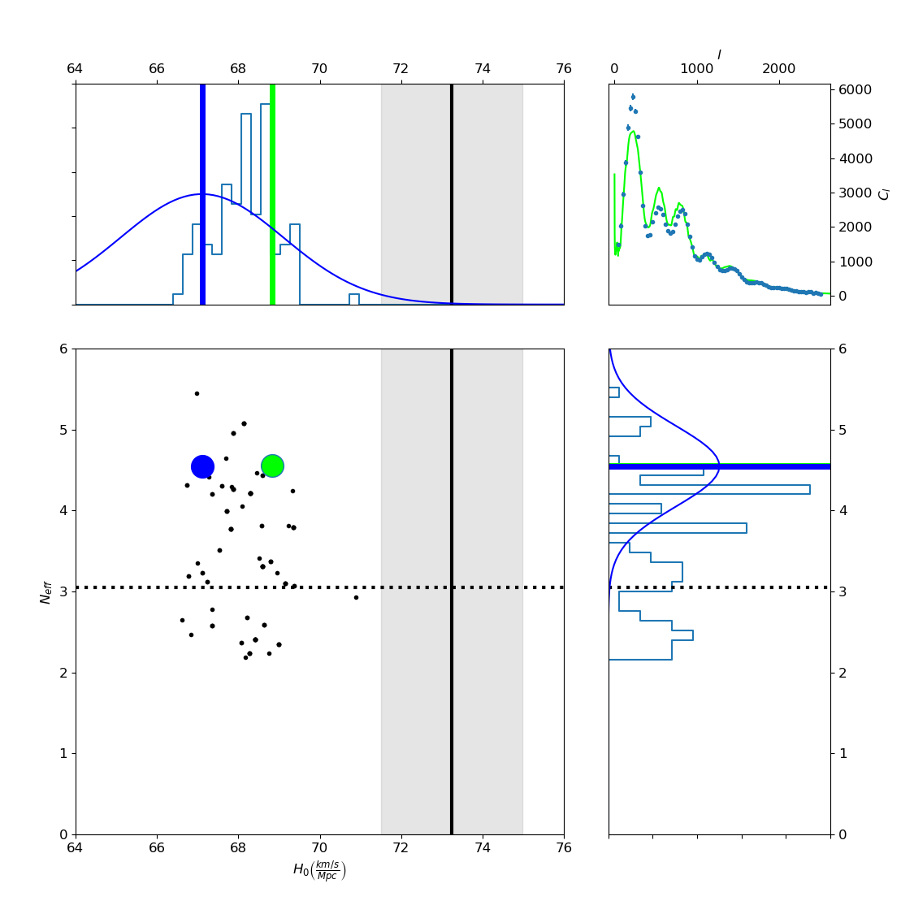

# Picorunner

Picorunner is an interactive demonstration meant to facilitate a presentation explaining how a *Markov chain Monte Carlo* (MCMC) algorithm can be used to explore an analytically unsolvable parameter space. In this case, the Cosmological Standard Model parameter space is simulated using [pypico](https://github.com/marius311/pypico), a neural network written by Marius Millea. 

Picorunner was written using pypico 3.3.0 (python 2.7). 

Example screenshot: 

Here, a Markov chain explores the *effective N* and *Hubble constant* space, with other parameters held constant (Planck 2015 values). 

* The collection of black points are the "tail" of the Markov chain, points having been previously evaluated as matching the observed data well enough to be added to the chain. Corresponding these black points, you can see histograms being built in the upper left and lower right. These histograms are the ultimate goal of the algorithm, they represent the likelihood distributions being sought. For instance, see how the histogram for the Hubble constant, H~0~, is beginning to accumulate near Planck's estimation of 67.74 ± 0.46 (km/Mpc*s).
* The blue point shows the current "head" of the chain, the point most recently evaluated to match the data. From this point is where the Markov chain seeks potential new points to add. The "head" is overlaid on the histograms, along with a gaussian that shows how far away the chain is likely to venture. 
* The green (or red) point shows where the chain is currently probing. The probe appears green if the new point isn't significantly worse at matching the data than the previous point (the "head"), red otherwise. In the upper right, you can see this evaluation: the green line compares the observed data (Planck) with pypico's evaluation of the point in question. (*l* and *C~l~* are dimensionless charictaristics observed in the cosmic microwave background.) If the probe is accepted, it is added to the Markov chain and becomes the new head. While running Picorunner, you can press *enter* in the console to step forward this process one point at a time. 
* The *Monte Carlo* part of *MCMC* means that in practice, this algorithm is run with many Markov chains in parallel. Overall, the Markov chains will be attracted to minima in the space, with the corresponding histograms revealing which underlying parameter values are most likely to best fit the observed data. 
